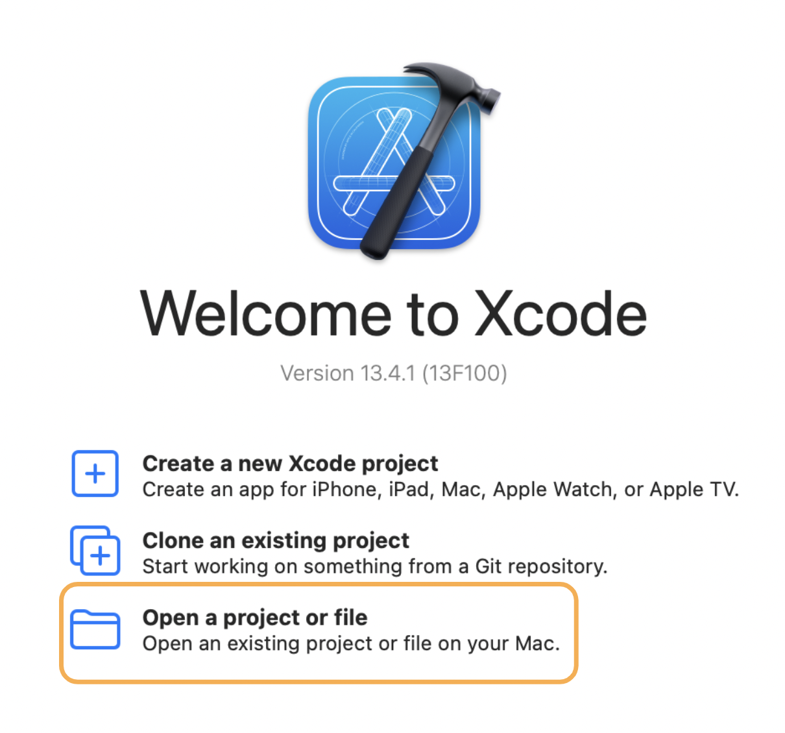
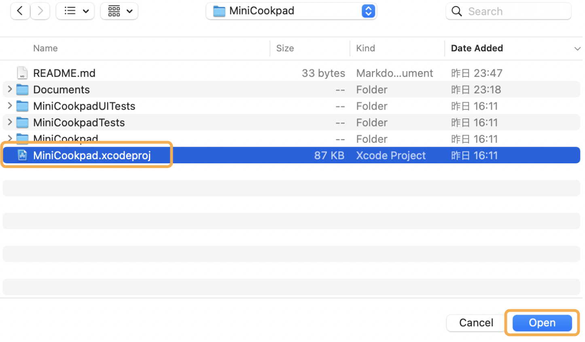
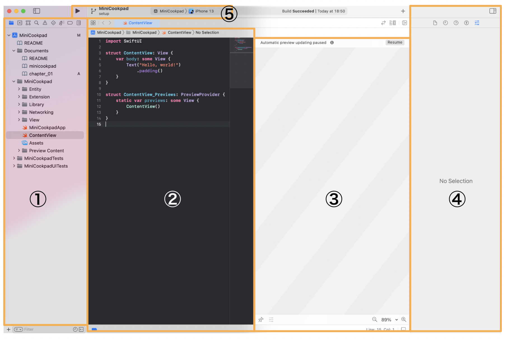
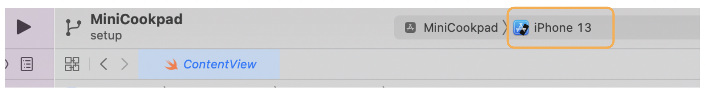
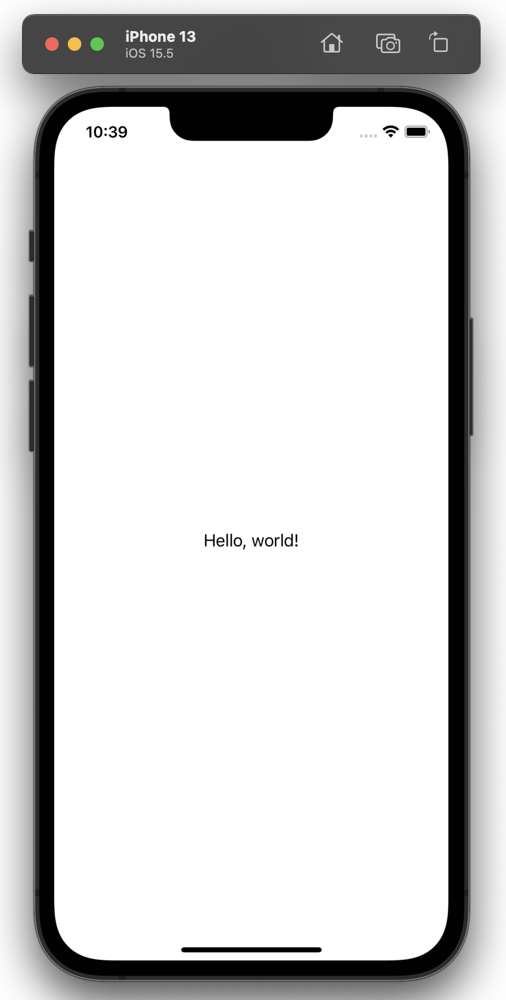

# iOSアプリ開発をはじめよう

まずは、Xcodeで

- ソースコードをビルドし、シミュレータでiOSアプリを動かすところ

までをやってみましょう。

## ForkとClone

このリポジトリを Fork して Clone してください。
作業中の質問に回答する際など、出来ているところまで push してもらう可能性があります。

## プロジェクトを開く

Xcode.appを開きます。

「Open a project or file」を選択してください



Fork したプロジェクトのあるフォルダを開いて、MiniCookpad.xcodeprojを選択し、openをクリックします。



## Xcodeの簡単な説明

プロジェクトを開くと、Xcodeの画面が開きます。

まず、左のペインから`ContentView.swift`を選択してください。

ソースコードが開くと次のような画面が開きます。



簡単にそれぞれ説明していきます。

### 1. ナビゲーションエリア

- ファイルツリーの表示、ツリーからファイルを選択してエディタエリアで開く、プロジェクト内検索（`⌘⇧F`）といった機能があります
### 2. エディタエリア
- ソースコードを記述する場所
#### 3. キャンバス
- Xcode Previewが表示される場所
### 4. インスペクタエリア
- 主にファイルの情報が表示されたり、SwiftUI 等を編集しているときの UI パーツのパラメータ調整をする場所
### 5. 実行、停止、アプリケーションの選択、実行対象の選択
- ここで実行するアプリケーション、シミュレータを選んで実行、停止ができる。

### 💡 便利なショートカット

[ショートカットリスト](https://github.com/cookpad/cookpad-internship-2019-summer/blob/master/ios/docs/shortcuts.md)に開発をする上で便利なショートカットを載せておくので、Chrome の別タブで開いたり、印刷して手元に置いたりしてみてください。
また、講義資料内では、対応する動作にショートカットがある場合は、(`ショートカットキー`)という表記を付けておきます。

#### 記号
- ⌘: コマンドキー(cmd)
- ⇧: シフトキー(shift)
- ⌃: コントロールキー(ctrl)
- ⌥: オプションキー(opt/alt)

## デバッグ実行をする

ではまずは「デバッグ実行」をしてシミュレータを起動します。
画面左上のエリアから実行対象として、適当なiPhoneのシミュレータを選択してください。

(この画像ではiPhone 13のシミュレータを実行対象にしています)



選択ができたら「▷」ボタンを押し実行しましょう。（`⌘R`でも可能です）
「Hello, world!」という文字がシミュレータの画面中心に表示されていれば成功です！



＊単純にビルドを行いソースコードが正しくコンパイルできるかを実行する場合は、（`⌘B`）でビルドのみを行うことができます。

## [補足] Opaque Result Type
ここで改めて、`ContentView.swift`のソースコードを見てみましょう。

```swift
import SwiftUI

struct ContentView: View {
    var body: some View {
        Text("Hello, world!")
            .padding()
    }
}
```

`struct ContentView: View` は、`ContentView`というstructが`View`というプロトコルに準拠していることを示しています。

では、`var body: some View` の`some`は何なのでしょうか。
これは、Swift5.1で導入された[Opaque Result Type](https://github.com/apple/swift-evolution/blob/master/proposals/0244-opaque-result-types.md)という仕様で、`some View`は「Viewプロトコルを満たすある一つの型」を表しています。

`body`の戻り値にOpaque Result Typeを使うことで、以下のようなメリットがあります

### 1. 具体的な型を意識せずに`body`の中身を記述できる＆Viewの内部実装を隠蔽できる
現状bodyの戻り値の型は`Text`ですが、例えば次の章で説明する`VStack`というViewとif文を使って

```swift
var body: some View {
    if condition {
        VStack {
            Text("Hello,")
            Text("World!")
        }
    } else {
        VStack {
            Text("こんにちは")
            Text("世界！")
        }
    }
}
```

と記述した場合、bodyの戻り値の型は`_ConditionalContent<VStack<TupleView<(Text, Text)>>, VStack<TupleView<(Text, Text)>>>`という複雑な型になってしまいます。

Opaque Result Typeを使うことで、このような複雑な型を意識せずに`body`の中身を記述することができます。また、Viewの内部実装を隠蔽することもできています。

### 2. `var body: View`よりも実行時のパフォーマンスが良い
`var body: View`のように指定しても`1.`は達成できます。しかし、戻り値を`var body: View`にすると、具体型を指定した時と比較して実行時のパフォーマンスが悪くなってしまいます（詳しくは[SE-0335](https://github.com/apple/swift-evolution/blob/main/proposals/0335-existential-any.md)などを見てください）。

Opaque Result Typeを使うと、コンパイル時に具体的な型として解決されるため、戻り値を`var body: View`にした時に生じる実行時のオーバーヘッドをなくすことができます。

---

[Chapter2へ進む](chapter_02.md)
