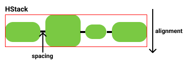

# レシピ一覧画面を作ろう part1
この章では、レシピ一覧画面でリスト表示するレシピのViewを作ってXcode Preview上で表示することを目指します。
完成するとXcode Previewで以下の画像のようになります。


この章では、レシピのViewの作成を通して

- 画像、テキストを表示する方法
- 複数の要素を縦(or横)方向に並べる方法
- ViewModifierを使ってレイアウトを調整する方法

を学んでいきます。

## 講義: SwiftUI Appの概要
*＊この講義部分は去年のサマーインターンの内容とほぼ同内容なので、この講義内容を後日復習したい場合は、GitHub上に公開されている[去年のサマーインターンの説明](https://github.com/cookpad/cookpad-internship-2021-summer-ios/blob/c91896defe178d6b415f8659a3946c3c2fabadf5/Documents/chapter_03.md#%E8%AC%9B%E7%BE%A9-swiftui-app%E3%81%AE%E6%A6%82%E8%A6%81)を参照してください。*

ハンズオンに入る前に、SwiftUIのViewの概要を説明します。

### SwiftUI Appのエントリーポイント
SwiftUI Appは`@main`という属性のついた、`App`プロトコルに準拠した構造体をエントリーポイントとして処理が開始されます。
`MiniCookpad`では`MiniCookpadApp.swift`というファイルに含まれる`struct MiniCookpadApp`がそれにあたります。

```swift
import SwiftUI

@main
struct MiniCookpadApp: App {
    var body: some Scene {
        WindowGroup {
            ContentView()
        }
    }
}
```

`body`プロパティの`WindowGroup`配下に書かれている`ContentView`がアプリの起動時に表示されるViewです。この`ContentView`を別のViewにすれば起動時に表示されるViewを変えることもできます。

ここに登場している、`App`, `WindowGroup`というのはSwiftUIのアプリを構成する概念を実装に落とし込んだものですが、iOSアプリでは意識する必要がないため、割愛します。
興味のある方は[App essentials in SwiftUI](https://developer.apple.com/videos/play/wwdc2020/10037/)を見てみてください。

## SwiftUI Viewの基本
次にViewの基本的な考え方を説明します。


SwiftUIでは基本の`View`として`Text`, `Button`, `Image`のような表示要素や、`VStack`, `HStack`などのレイアウトを行う要素を提供しています。

また、Viewは`ViewModifier`という機能でカスタマイズをすることができます。

`ViewModifier`にはViewの周りに隙間をあける`.padding`や描画するフォントを変える`.font`等の表示に関わるものや、`onTapGesture`や`onAppear`などViewのイベントに関わるものがあります。

これらの基本的な`View`と`ViewModifier`を組み合わせて、アプリケーションのビューを組んでいきます。

例えば図の例では、`Hello`と`World`という2つの文字列を`Text`というViewで表示しています。
`Hello`を表示している`Text`のフォントを`.font`というModifierを使って変えています。
この2つのViewを`VStack`という自身の子を縦に並べるViewを使って並べています。

### Viewの実装とXcode Preview
次にViewの実装ファイルと、Xcode Previewの説明します。

`ContentView.swift`を開き、`キャンバスエリア`の`Resume`をタップすると以下のような表示になります。


1. カスタムビューの定義。`View` protocolを実装した`struct`を定義する。
2. カスタムビューの中身。`body` というcomputed propertyを定義し、その中にコンテンツを追加する
3. Xcode Previewの定義。`PreviewProvider`プロトコルを実装したstructを定義し、`static var previews`というcomputed propertyにPreviewエリアに表示したい内容を記述します。
`preview対象のview名_Previews`という名前で定義をします。
4. Previewのキャンバスです。表示の確認だけでなく、GUIによるViewの編集を行うことができます。

## ハンズオン
ここからはハンズオンです。

### 空っぽの画面を作る
プロジェクトに`RecipeListRow.swift`ファイルを追加します。`View/RecipeList`グループを右クリックし、New File...を選択します。


`SwiftUI View`を選択し、ダブルクリックをするか、`Next`ボタンをクリックしてください。


`RecipeListRow`という名前に変え、`Create`ボタンをクリックします。
その際`Targets`のチェックが`MiniCookpad`に**のみ**入っていることを確認してください。


`Text("Hello World")`だけが表示されているファイルができました。


新規に作ったSwiftUI Viewはすべてこの形です。

### `RecipeListRow`に`RecipeListItem`を持たせる
`RecipeListRow`にpropertyの`item`を追加します。`item`の型は、既にプロジェクトに追加してある`RecipeListItem`にします。

```diff
struct RecipeListRow: View {
+   let item: RecipeListItem
    var body: some View {
        Text("Hello, World!")
    }
}
```

### レシピタイトルを表示する
レシピタイトルを表示できるように`RecipeListRow`の`body`を実装します。

```diff
struct RecipeListRow: View {
    let item: RecipeListItem
    var body: some View {
-       Text("Hello, World!")
+       Text(item.recipe.title)
    }
}
```

このままでは何も表示されないので、 Previewの実装にはダミーの値を渡しましょう。

```diff
struct RecipeListRow_Previews: PreviewProvider {
+   static let item = RecipeListItem(
+       recipe: .init(
+           id: 1,
+           title: "ホワイトソースのパスタ",
+           description: "おもてなし・パーティに最適♪",
+           imageUrl: nil,
+           user: .init(name: "クックサマーインターン"),
+           ingredients: ["芽キャベツ", "生ハム", "ホワイトソース", "パスタ", "塩"].map(GetRecipeListResponse.Recipe.Ingredient.init)
+       ),
+       hashtags: [
+           .init(id: 1, name: "パーティー料理"),
+           .init(id: 2, name: "パーティーに"),
+           .init(id: 3, name: "おもてなし"),
+       ]
+   )

    static var previews: some View {
-       RecipeListRow()
+       RecipeListRow(item: item)
    }
}
```

### 複数の要素を配置する
今回作成するビューには以下の要素を配置する必要があります。

* レシピ写真
* レシピタイトル
* 作者名
* 材料
* ハッシュタグ

SwiftUIのビューを作成する際には、コンテンツ、レイアウト、動作をビューの`body`に記述していきます。 しかし、`body`は単一のビューしか返しません。 ではどうすれば良いでしょうか。 複数のパーツを組み合わせたビューを表現するには、スタックを使って各パーツを並べます。 スタックには、水平方向に並べる`HStack`, 垂直方向に並べる`VStack`, 前後方向(画面の前面から背面への方向)に並べる`ZStack`の3種類があります。

まずは`HStack`を使って画像とレシピタイトルを水平方向に並べてみましょう。SwiftUIでは、URLを指定して画像を読み込むことができる`AsyncImage`というViewがありますが、画像のキャッシュ機能がないため、今回は既にプロジェクト内に用意されている`RemoteImage`というViewを利用します。

`Text`を`HStack`で包み、`RemoteImage`を`Text`の上に追加します。

```diff
struct RecipeListRow: View {
    let item: RecipeListItem
    var body: some View {
-       Text(item.recipe.title)
+       HStack {
+           RemoteImage(urlString: item.recipe.imageUrl)
+           Text(item.recipe.title)
+       }
    }
}
```

Previewを確認し、引き伸ばされた灰色の領域が表示されていればOKです。

次に作者名、材料、ハッシュタグを追加しましょう。これらはレシピタイトルの下に配置されています。垂直方向に要素をグルーピングするのには`VStack`を使います。`Text(item.recipe.title)`を`VStack`で包み、作者名、材料、ハッシュタグをそれぞれTextで追加してみます。

材料、ハッシュタグはどちらもstructの配列になっているので、材料は`name`を取り出して`,`で連結して表示、ハッシュタグも`name`を取り出して先頭に`#`を付けつつスペースで連結して表示しましょう

```diff
struct RecipeListRow: View {
    let item: RecipeListItem
    var body: some View {
        HStack {
            RemoteImage(urlString: item.recipe.imageUrl)
-           Text(item.recipe.title)
+           VStack {
+               Text(item.recipe.title)
+               Text("by \(item.recipe.user.name)")
+               Text(item.recipe.ingredients.map(\.name).joined(separator: ", "))
+               Text(item.hashtags.map({ "#\($0.name)" }).joined(separator: " "))
+           }
+       }
    }
}
```


#### [補足] KeyPath
`Text(item.recipe.ingredients.map(\.name).joined(separator: ", "))`の`\.name`とはなんでしょうか。これは`\GetRecipeListResponse.Recipe.Ingredient.name`を省略したもので、この例は「GetRecipeListResponse.Recipe.Ingredientのnameプロパティへのキー」という意味です。

`KeyPath`は任意の型のプロパティに添え字アクセスをするための仕組みです。Swift5.2から[`map(_:)`](https://developer.apple.com/documentation/swift/array/map(_:)-87c4d)などの関数で、`(Root) -> Value`形式のクロージャを渡す代わりに`KeyPath`を使うことができるようになりました（詳細は[SE-0249](https://github.com/apple/swift-evolution/blob/master/proposals/0249-key-path-literal-function-expressions.md)を見てください）。

### レイアウトを整える
ここまでで表示する要素を全て並べることができたので、次はレイアウトを整えていきます。
以下のように要素を配置します。


* 画像のサイズを100x100に収める
* 画像に4pxの角丸を付ける
* 画像とテキスト部分は上揃えにする
* テキスト部分は左揃えにする
* 画像とテキスト間を8px空ける
* テキスト間を6px空ける
* 材料とハッシュタグは1行表示にする
* 各テキストの色とフォントサイズを変える

#### 1. Viewを固定サイズで表示する
まずは画像を100x100に収めます。
Viewを固定のサイズにしたい場合、[`frame(width:height:alignment:)`](https://developer.apple.com/documentation/SwiftUI/View/frame(width:height:alignment:))というModifierを使います。

```diff
struct RecipeListRow: View {
    let item: RecipeListItem
    var body: some View {
        HStack {
            RemoteImage(urlString: item.recipe.imageUrl)
+               .frame(width: 100, height: 100)
            VStack {
                Text(item.recipe.title)
```


#### 2. Viewに角丸を付ける
さらに、画像に4pxの角丸を付けます。
Viewに角丸を付けるには、[`cornerRadius(_:antialiased:)`](https://developer.apple.com/documentation/swiftui/path/cornerradius(_:antialiased:))というModifierを使います。第1引数に角丸の大きさを指定します。

```diff
struct RecipeListRow: View {
    let item: RecipeListItem
    var body: some View {
        HStack {
            RemoteImage(urlString: item.recipe.imageUrl)
                .frame(width: 100, height: 100)
+               .cornerRadius(4)
            VStack {
                Text(item.recipe.title)
```


### 3. Stackのalignment
次に、画像とテキスト部分は上揃えにしたいです。これはModifierでなく、`HStack`のプロパティで設定します。以下のように記述してください。

```diff
struct RecipeListRow: View {
    let item: RecipeListItem
    var body: some View {
-       HStack {
+       HStack(alignment: .top) {
            RemoteImage(urlString: item.recipe.imageUrl)
```



*昨年のサマーインターン講義より引用*

この`alignment`プロパティは、`HStack`が自分の配下のViewの縦方向の位置を決めるためのプロパティです。 デフォルトではスタックの中心（center）に来るように設定されています。

同様に、右側のテキスト部分もセンタリングされているので、これを左寄せにしたいです。 これは`VStack`の`alignment`のプロパティで設定します。 以下のように記述してください。

```diff
            RemoteImage(urlString: item.recipe.imageUrl)
                .frame(width: 100, height: 100)
                .cornerRadius(4)
-           VStack {
+           VStack(alignment: .leading) {
                Text(item.recipe.title)
```


*昨年のサマーインターン講義より引用*

これは`VStack`が自分の配下のViewの横方向の位置を決めるためのプロパティです。 `HStack`と同様、デフォルトでは中心に来るように設定されています。

#### 補足: leadingとtrailing
leadingが先頭、trailingが末尾を表しています。なぜleft, rightでないのかというと、 アラビア語等、右側から左側に向かって文字を読んでいく言語圏へのサポートのためです。 日本語のような左から右へ読んでいく言語ではleadingはleft, trailingはrightを意味し、アラビア語等ではその逆です。 left, rightでなく, leading, trainlingの指定しておくことで、言語設定が異なるデバイスでも、その言語にとって自然な方向にコンテンツが配置されるようになっています。 SwiftUIに限らずアップルのUIのフレームワークでは頻出する単語なので覚えておきましょう

*[去年の講義内容](https://github.com/cookpad/cookpad-internship-2021-summer-ios/blob/c91896defe178d6b415f8659a3946c3c2fabadf5/Documents/chapter_03.md#%E8%A3%9C%E8%B6%B3-leading%E3%81%A8traiilng)より引用*

#### 4. Stackのspacing
次に画像とテキスト部分の間を8px空けます。こちらも`HStack`のプロパティで設定することができます。以下のように記述してください。

```diff
    var body: some View {
-       HStack(alignment: .top)
+       HStack(alignment: .top, spacing: 8) {
            RemoteImage(urlString: item.recipe.imageUrl)
                .frame(width: 100, height: 100)
```

`spacing`プロパティは、HStack内のView間の余白を設定するためのプロパティです。

同様に、テキスト間も6px空けたいので、以下のように記述してください。

```diff
            RemoteImage(urlString: item.recipe.imageUrl)
                .frame(width: 100, height: 100)
                .cornerRadius(4)
-           VStack(alignment: .leading) {
+           VStack(alignment: .leading, spacing: 6) {
                Text(item.recipe.title)
```

このように、Stack内の全要素を等間隔で隙間を開けたい場合は、Stackのspacingのプロパティで制御することができます。

＊要素間に任意の大きさの幅を空けたい場合は[`Spacer`](https://developer.apple.com/documentation/swiftui/spacer)、Stackの上下左右に余白を空けたい場合は[`padding(_:_:)`](https://developer.apple.com/documentation/swiftui/view/padding(_:_:))Modifierを使うことで余白を設定することができます。

## 5. テキストの最大行数を指定する
材料とハッシュタグは最大1行表示にしたいです。[`lineLimit(_:)`](https://developer.apple.com/documentation/swiftui/view/linelimit(_:)-513mb?changes=_3)というModifierを使うことで、テキストの最大行数を指定することができます。

```diff
            VStack(alignment: .leading, spacing: 6) {
                Text(item.recipe.title)
                Text("by \(item.recipe.user.name)")
                Text(item.recipe.ingredients.map(\.name).joined(separator: ", "))
+                   .lineLimit(1)
                Text(item.hashtags.map({ "#\($0.name)" }).joined(separator: " "))
+                   .lineLimit(1)
            }
```


## 6. テキストの色とフォントサイズを指定する
最後に、各テキストの色とフォントサイズを指定します。テキストの色は[`foregroundColor(_:)`](https://developer.apple.com/documentation/swiftui/text/foregroundcolor(_:))Modifier、フォントサイズは[`font(_:)`](https://developer.apple.com/documentation/swiftui/text/font(_:))Modifierを使うことで指定できます。以下のように記述してください（レシピタイトルに関しては、プロジェクト内でレシピタイトル用の色を独自に定義しています）。

```diff
            VStack(alignment: .leading, spacing: 6) {
                Text(item.recipe.title)
+                   .font(.headline)
+                   .foregroundColor(.recipeTitle)
                Text("by \(item.recipe.user.name)")
+                   .font(.caption)
+                   .foregroundColor(.gray)
                Text(item.recipe.ingredients.map(\.name).joined(separator: ", "))
+                   .font(.caption2)
+                   .foregroundColor(.gray)
                    .lineLimit(1)
                Text(item.hashtags.map({ "#\($0.name)" }).joined(separator: " "))
+                   .font(.caption2)
+                   .foregroundColor(.black)
                    .lineLimit(1)
            }
```

### 確認
お疲れさまでした！
ここで以下の表示になっていればOKです！


## [補足] ViewBuilder
*講義後追記*

この章で行った実装では、下記のコードのように、HStack・VStackのTrailing Closure内に`Text`などのViewを複数個並列で記述していました。この書き方を可能にしている[`ViewBuilder`](https://developer.apple.com/documentation/swiftui/viewbuilder)という仕組みについて補足しておきます。

```swift
import SwiftUI

struct RecipeListRow: View {
    let item: RecipeListItem

    var body: some View {
        VStack {
            Text(item.recipe.title)
            Text("by \(item.recipe.user.name)")
        }
    }
```

`ViewBuilder`はクロージャからViewを構築する仕組みで、[`Result Builders`](https://github.com/apple/swift-evolution/blob/main/proposals/0289-result-builders.md)という言語機能の一種です。クロージャに`@ViewBuilder`属性を付けることで使用することができます。

先程のVStackの例では、VStackのinitのTrailing Closureに対応する、`content`という引数名のクロージャの前に`@ViewBuilder`属性が付いているため、このクロージャには`ViewBuilder`が適用されています。

`@inlinable public init(alignment: HorizontalAlignment = .center, spacing: CGFloat? = nil, @ViewBuilder content: () -> Content)`

`@ViewBuilder`属性が付いているクロージャでは`ViewBuilder`が持っている各種build関数が適用され、適用後の結果がそのクロージャの戻り値となります。

先程のVStackの例では、クロージャ内に2つの`Text`が記述されているため

```swift
extension ViewBuilder {
    public static func buildBlock<C0, C1>(_ c0: C0, _ c1: C1) -> TupleView<(C0, C1)> where C0 : View, C1 : View
}
```

関数が適用され、以下のように解釈されます。

```swift
    var body: some View {
        VStack {
            ViewBuilder.buildBlock(
                Text(item.recipe.title),
                Text("by \(item.recipe.user.name)")
            )
        }
    }
```

よってこの例では、VStackの`content`の戻り値`Content`は`TupleView<(Text, Text)>`となっています。

---

[Chapter3へ進む](chapter_03.md)
