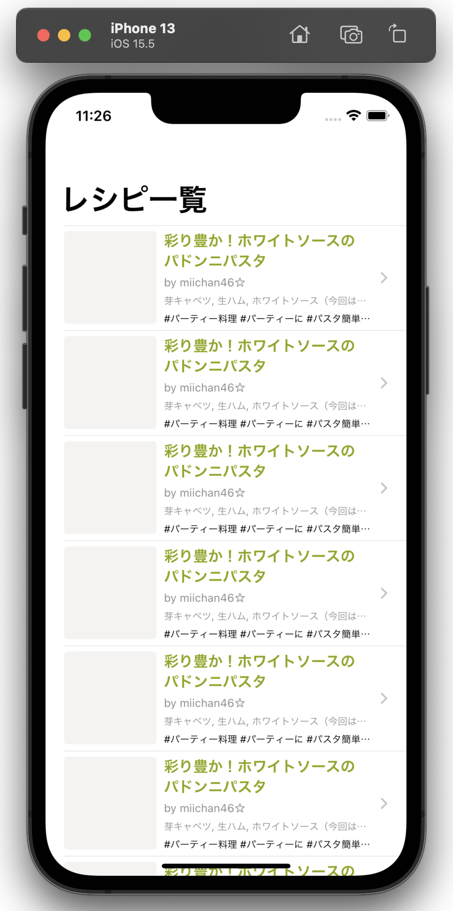
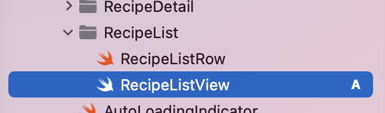
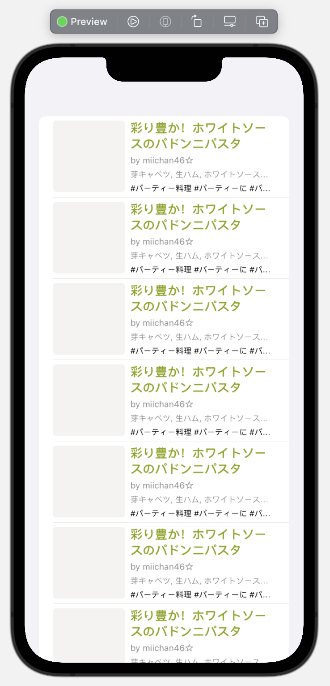
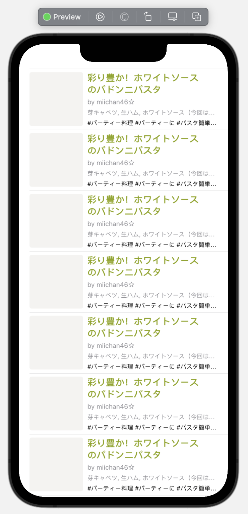
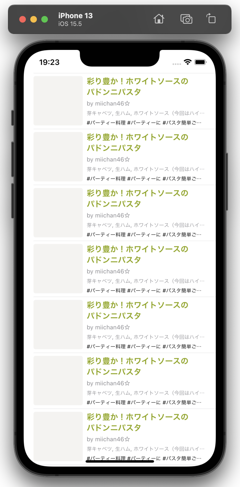
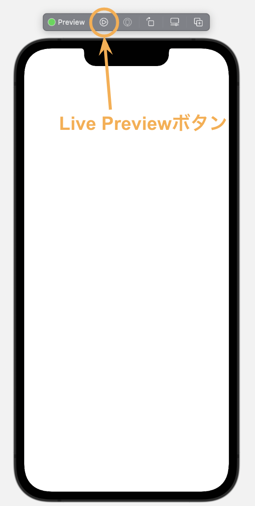
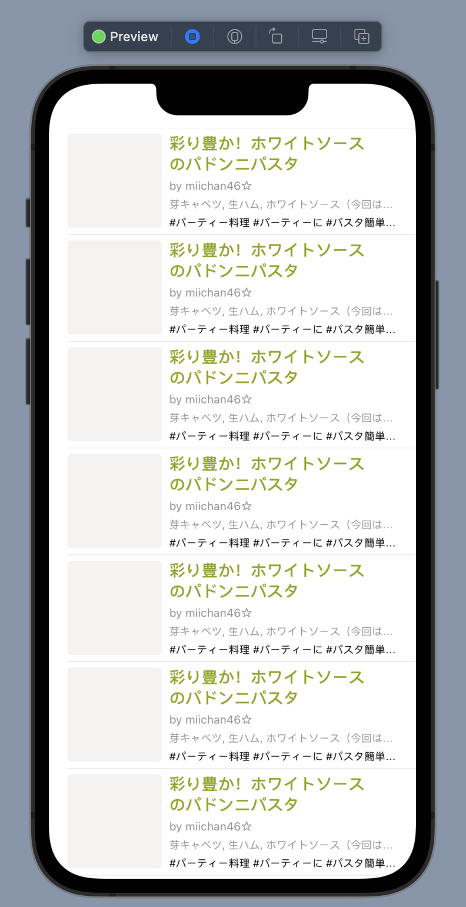
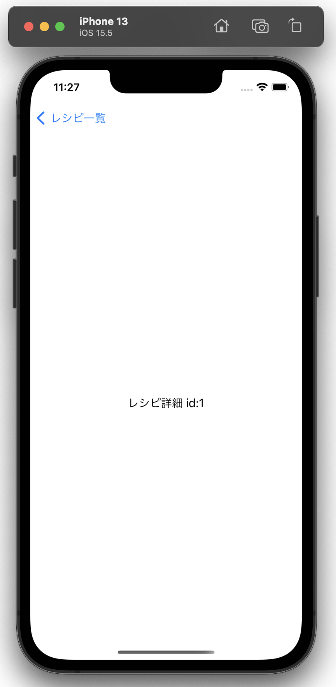

# レシピ一覧画面を作ろう part2
この章では、前の章で作成したレシピのViewを使ってレシピをリスト表示し、レシピをタップすると仮のレシピ詳細画面に遷移するところまでを目指します。完成すると、シミュレータまたはXcode Preview（Live Preview）上で以下の画像のようになります。



この章では、レシピのリスト表示・レシピタップ時の画面遷移を通して

- Viewをリスト表示する方法
- StateによるViewの状態の保持とプロパティ変更の検知
- ViewのIdentity
- NavigationViewによる画面遷移

について学んでいきます。
また、この章はまずはハンズオンを行い、そこで出てきた要素について講義を行うという形式で進めます。

## レシピをリスト表示する
最初に、前章と同じように`RecipeListView.swift`を`View/RecipeList`グループ下に作成します。



```swift
import SwiftUI

struct RecipeListView: View {
    var body: some View {
        Text("Hello, World!")
    }
}

struct RecipeListView_Previews: PreviewProvider {
    static var previews: some View {
        RecipeListView()
    }
}
```

表示するレシピのデータが必要なので、`RecipeListView`に`RecipeListItem`の配列を保持する`items` propertyを追加します。初期値として空の配列を代入しておきます。

```diff
struct RecipeListView: View {
+   var items: [RecipeListItem] = []
    var body: some View {
        Text("Hello, World!")
    }
}
```

### List
次に、[`List`](https://developer.apple.com/documentation/swiftui/list)というViewを使って、レシピのリストを表示します。以下のようにListをbody内に記述し、前章で作成した`RecipeListRow`を各行のViewにします。

```diff
struct RecipeListView: View {
    var body: some View {
+       List(items, id: \.recipe.id) { item in
+           RecipeListRow(item: item)
+       }
-       Text("Hello, World!")
    }
}
```

このままでは何も表示されないので、Previewでサンプルデータを渡して表示を確認します。既にプロジェクト内にレシピのサンプルデータを返してくれる関数が用意されているので、これを利用します。

```diff
struct RecipeListView_Previews: PreviewProvider {
    static var previews: some View {
-       RecipeListView()
+       RecipeListView(items: RecipeListSampleDataProvider.makeRecipeListSampleData())
    }
}
```



Listは`listStyle`というModifierを使って挙動や見た目を変更することができます。今回は[`PlainListStyle`](https://developer.apple.com/documentation/swiftui/plainliststyle)を指定します。

```diff
    var body: some View {
        List(items, id: \.recipe.id) { item in
            RecipeListRow(item: item)
        }
+       .listStyle(PlainListStyle())
    }
```



Listの見た目が変わりました。

### ViewのIdentity
`List`の`id`という名前の第2引数に、`\.recipe.id`という前章にも出てきた`KeyPath`を渡しています。これは各行のViewのIdentifierを指定するために必要なものです。

ViewのIdentityについては[WWDC2021 Demystify SwiftUI](https://developer.apple.com/videos/play/wwdc2021/10022/?time=251)で詳しく述べられているのですが、ここではその要旨のみを説明します。

SwiftUIの全てのViewはIdentityを持っています。
Identityは

* Explicit Identity（明示的なIdentity）
* Structural Identity（構造的なIdentity）

の2種類があり、実装者が明示的にIdentifierを指定していないViewは、SwiftUIのフレームワークがView階層の構造を使って構造的なIdentityを持ちます。

一方で、`List`のようなデータ駆動型構造のものは、各行のViewのIdentifierを、データのpropertyをもとに実装者が明示的に指定する必要があります（明示的なIdentity）。

IdentityはSwiftUIのフレームワークがViewを識別する根拠となるものなので、stable(不変)かつunique(一意)なIdentifierを指定するようにしましょう（これらの性質を欠いたIdentifierを指定してしまうと、SwiftUIのフレームワークが行う差分更新やアニメーションなどで予期せぬ挙動を引き起こしたり、この後説明するStateなどが意図せぬタイミングで消えてしまったりします）。

今回は、`GetRecipeListResponse.Recipe`がidを持っており、これはRecipe全体でユニークです。なので、今回は`KeyPath`に`\.recipe.id`を渡しています。

### Identifiable
`List`に渡す配列の要素のstructを[`Identifiable`](https://developer.apple.com/documentation/swift/identifiable)というprotocolに準拠させることで、`KeyPath`の指定を省略することができます。

`Entity`グループ内にある`RecipeListItem.swift`を開き、以下のように`Identifiable` protocolへの準拠と、protocolが要求する`id` propertyを指定しましょう。

RecipeListItem.swift
```diff
import Foundation

+struct RecipeListItem: Identifiable {
+   var id: Int64 { recipe.id }
    let recipe: GetRecipeListResponse.Recipe
    let hashtags: [Hashtag]
}
```

これにより、`List`で`KeyPath`の指定を省略できるようになりました。
```diff
    var body: some View {
-       List(items, id: \.recipe.id) { item in
+       List(items) { item in
            RecipeListRow(item: item)
        }
```

## `items` propertyの値を更新する
次に、`items` propertyの値の更新を行なってみます。この章ではまだWeb APIとの通信などは行いませんが、[`asyncAfter(deadline:execute:)`](https://developer.apple.com/documentation/dispatch/dispatchqueue/2300020-asyncafter)という関数を使って、`List`が表示された1秒後に`items` propertyにサンプルデータを代入してpropertyの値を更新してみましょう。

### `@State`
まず最初に、`items` propertyに`@State`属性を付けます。`@State`属性を付けたpropertyは、それを宣言したViewの内部でのみアクセスすべきものなので、`private`を付けておきましょう。

```diff
struct RecipeListView: View {
+   @State private var items: [RecipeListItem] = []

    var body: some View {
        List(items) { item in
            RecipeListRow(item: item)
        }
        .listStyle(PlainListStyle())
    }
}

struct RecipeListView_Previews: PreviewProvider {
    static var previews: some View {
-       RecipeListView(items: RecipeListSampleDataProvider.makeRecipeListSampleData())
+       RecipeListView()
    }
}
```

[`State`](https://developer.apple.com/documentation/swiftui/state)はViewのpropertyの変更を検知する仕組みです。`@State`属性を付けたpropertyの値は、SwiftUIのフレームワークが管理するストレージによって保持され、propertyの値が変わると、そのpropertyに依存しているViewがSwiftUIのフレームワークによって再描画されるようになります。

### なぜpropetyの値をSwiftUIが管理するストレージが保持するのか
なぜViewプロトコルに準拠したstruct自身ではなく、SwiftUIのフレームワークが管理するストレージがpropertyの値を保持するのでしょうか。

RecipeListViewなどのViewプロトコルに準拠したstructは、実際のビューを描画するための設計図のようなものです。RecipeListViewのインスタンスが生成されると、`body`が呼ばれ、その出力をもとに実際のビューが描画されます。実際のビューが描画されたら、RecipeListViewのインスタンスはSwiftUIのフレームワークによって適切なタイミングで破棄され、再描画のタイミングでインスタンスが再生成されます。つまり、RecipeListViewのインスタンスの生存期間は、実際のビューの生存期間よりも非常に短いのです[^1]。

[^1]:[WWDC2020 Data Essentials in SwiftUI](https://developer.apple.com/videos/play/wwdc2020/10040/?time=1406)などで説明されています

そこで、SwiftUIのフレームワークが管理するストレージによって保持することで、実際のビューが生存している間状態を保持することを可能にしています（実際のビューが消えるとStateも消えます）。

### onAppear
[`onAppear(perform:)`](https://developer.apple.com/documentation/swiftui/view/onappear(perform:))というModifierを使うと、それを付けたViewが画面に表示される直前に処理を実行することができます。`List`に`onAppear(perform:)`Modifierを付け、`List`が表示された1秒後に`items` propertyにサンプルデータを代入して、propertyの値を更新してみましょう。

```diff
    var body: some View {
        List(items) { item in
            RecipeListRow(item: item)
        }
        .listStyle(PlainListStyle())
+       .onAppear {
+           DispatchQueue.main.asyncAfter(deadline: .now() + 1) {
+               items = RecipeListSampleDataProvider.makeRecipeListSampleData()
+           }
+       }
    }
```

では、実際の表示をシミュレータを使って確認してみます。
現状はアプリを起動した時に表示されるViewが`ContentView`になっているので、`MiniCookpadApp.swift`を開き、アプリ起動後に表示されるViewを`RecipeListView`にします。

MiniCookpadApp.swift
```diff
import SwiftUI

@main
struct MiniCookpadApp: App {
    var body: some Scene {
        WindowGroup {
-           ContentView()
+           RecipeListView()
        }
    }
}
```

ここまででシミュレータを実行してみましょう。しばらく待った後に先程のサンプルデータが表示されればOKです。



または、`RecipeListView`のXcode PreviewのLive Previewボタンを押すことでも表示を確認することができます。





## 画面遷移
最後に、リストの各行のレシピをタップして画面遷移ができるようにしましょう。

### NavigationView
最初に、画面遷移をするためには`RecipeListView`を[`NavigationView`](https://developer.apple.com/documentation/swiftui/navigationview)で囲う必要があります。`MiniCookpadApp.swift`を開いて、以下のように記述します。
`NavigationView`で囲っただけだと、アプリをデバッグ実行した時にコンソールに大量のAutoLayoutの制約エラーが出てしまうため、`.navigationViewStyle(.stack)`も指定してコンソールにエラーが出力されるのを回避しています。

```diff
import SwiftUI

@main
struct MiniCookpadApp: App {
    var body: some Scene {
        WindowGroup {
-           RecipeListView()
+           NavigationView {
+               RecipeListView()
+           }
+           .navigationViewStyle(.stack) // AutoLayoutのエラーを回避するため
        }
    }
}
```

同様に`RecipeListView.swift`を開いて、Previewも`NavigationView`で囲っておきます。

```diff
struct RecipeListView_Previews: PreviewProvider {
    static var previews: some View {
-       RecipeListView()
+       NavigationView {
+           RecipeListView()
+       }
    }
}
```

### NavigationLink
次に、レシピ一覧画面のレシピをタップしたら、レシピ詳細画面に遷移できるようにします。画面遷移の方法は様々な種類がありますが、今回は[`NavigationLink`](https://developer.apple.com/documentation/swiftui/navigationlink)を使った画面遷移が適しているので、これを使います。

`RecipeListView.swift`を開いて、`RecipeListRow`を`NavigationLink`で囲います。まだレシピ詳細画面のViewは作成しないので、仮で`Text`を遷移先に指定します。

```diff
struct RecipeListView: View {
    @State private var items: [RecipeListItem] = []

    var body: some View {
        List(items) { item in
-           RecipeListRow(item: item)
+           NavigationLink(destination: Text("レシピ詳細 id:\(item.recipe.id)")) {
+               RecipeListRow(item: item)
+           }
        }
        .listStyle(PlainListStyle())
```

仕上げに`navigationTitle`Modifierを使って、タイトルの設定をします。タイトルは`レシピ一覧`にしておきます。

```diff
struct RecipeListView: View {
    @State private var items: [RecipeListItem] = []

    var body: some View {
        List(items) { item in
            NavigationLink(destination: Text("レシピ詳細 id:\(item.recipe.id)")) {
                RecipeListRow(item: item)
            }
        }
        .listStyle(PlainListStyle())
        .onAppear {
            DispatchQueue.main.asyncAfter(deadline: .now() + 1) {
                items = RecipeListSampleDataProvider.makeRecipeListSampleData()
            }
        }
+       .navigationTitle("レシピ一覧")
    }
}
```

## 確認
お疲れさまでした！
ここでシミュレータを実行し、以下の表示になっていればOKです！

| 一覧 | 詳細 |
| :---: | :---: |
|  |  |

---

[Chapter4へ進む](chapter_04.md)
