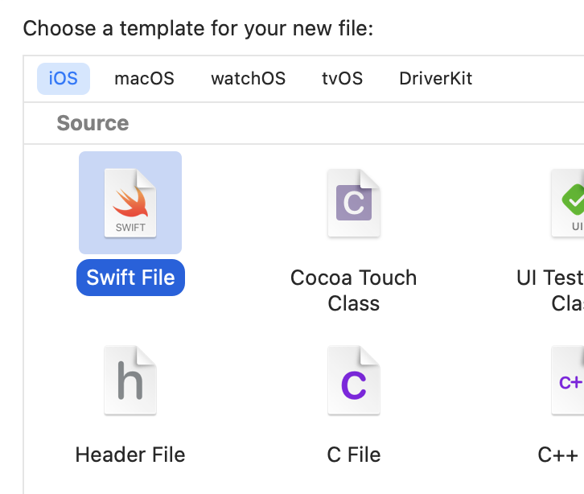
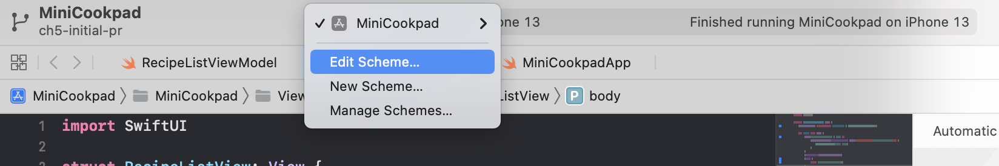
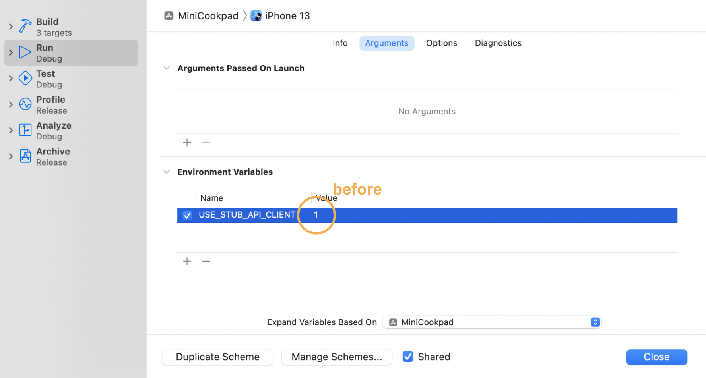
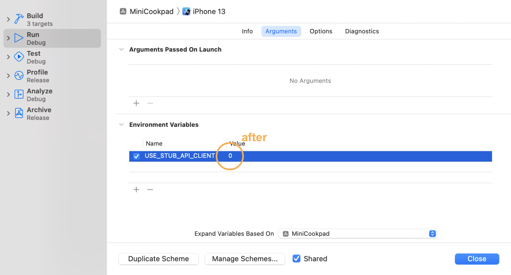

# レシピ一覧画面を作ろう part3
この章では、いよいよレシピ一覧画面でWeb APIからデータを取得して表示します。
完成すると、シミュレータ上で以下の画像のようになります。


この章では

- ViewModelを導入して、APIリクエストとデータの更新をViewから分離する方法
- ObservableObjectに準拠したクラスのインスタンスのプロパティ変更の検知
- Swift Concurrencyを使った非同期処理
- MainActorを使ったメインスレッド上での処理の実行

について学んでいきます。

## ViewModelを作る
### なぜViewModelを作るのか
API通信処理なども全てViewに記述してしまうと、Viewは瞬く間に肥大化し、コードの可読性が悪くなってしまいます。そこで今回APIリクエストを送るにあたり、ViewModelというクラスを新たに作成します。

ViewModelは主にMVVMアーキテクチャで使われるもので責務にもいくつかのバリエーションがありますが、今回作成するViewModelは簡易的なアーキテクチャとして「Viewからのインプットに応じてAPIリクエストを行い、自信が保持しているデータを更新するもの」として定義します。Viewは、APIリクエストの詳細はViewModelに任せつつ、ViewModelのデータを監視し、データの更新があったらViewを再描画します。


### RecipeListViewModel
それでは実際に、ViewModelを作成していきます。
プロジェクトに`RecipeListViewModel.swift`ファイルを追加します。`View/RecipeList`グループを右クリックし、New File...を選択します。


`Swift File`を選択し、ダブルクリックをするか、`Next`ボタンをクリックしてください。



`RecipeListViewModel`という名前に変え、`Create`ボタンをクリックします。
その際`Targets`のチェックが`MiniCookpad`に**のみ**入っていることを確認してください。

新規に作られた`RecipeListViewModel.swift`のファイルを、以下のように書き換えます。

```swift
final class RecipeListViewModel {}
```

### ObservableObject
次に、ViewModelのデータをViewが監視できるようにします。

まず、RecipeListViewModelを[`ObservableObject`](https://developer.apple.com/documentation/combine/observableobject) protocolに準拠させ、`@Published`属性をつけた`items` propertyを追加します。以下のように記述してください。

```diff
+import SwiftUI
+
-final class RecipeListViewModel {}
+final class RecipeListViewModel: ObservableObject {
+    @Published var items: [RecipeListItem] = []
+}
```

`ObservableObject` protocolに準拠すると、`@Published`属性をつけたpropertyが変更される直前に、[`objectWillChange`](https://developer.apple.com/documentation/combine/observableobject/objectwillchange-2oa5v)という[`Publisher`](https://developer.apple.com/documentation/combine/publisher)(時間の経過とともに連続した値を送ることができるもの)に値を送ってくれます。

この`objectWillChange` PublisherをViewが購読することで、ViewはViewModelのデータを監視することができるようになります。

### StateObject
では、Viewはどのようにして`ObservableObject` protocolに準拠したクラスのインスタンスの`objectWillChange` Publisherを購読するのでしょうか。

[`StateObject`](https://developer.apple.com/documentation/swiftui/stateobject)、[`ObservedObject`](https://developer.apple.com/documentation/swiftui/observedobject)、[`EnvironmentObject`](https://developer.apple.com/documentation/swiftui/environmentobject)のいずれかの属性をつけてクラスのインスタンスをViewのpropertyに追加することで、自動的にViewは`objectWillChange` Publisherを購読し、値が送られてきたときにViewが再描画されるようになります。

今回は`RecipeListViewModel`のインスタンス化を`RecipeListView`内で行うため、`StateObject`を選択します（残りの2つについてはAppleのドキュメントを各自で見てください）。`RecipeListView.swift`を開いて、以下のように記述してください。

RecipeListView.swift
```diff
struct RecipeListView: View {
-   @State private var items: [RecipeListItem] = []
+   @StateObject private var viewModel = RecipeListViewModel()

    var body: some View {
```

この変更だけではエラーが出てしまうので、以下のようにコードを書き換え、RecipeListViewModelの`items` propertyを使うようにします。

```diff
struct RecipeListView: View {
    @StateObject private var viewModel = RecipeListViewModel()

    var body: some View {
-       List(items) { item in
+       List(viewModel.items) { item in
            NavigationLink(destination: Text("レシピ詳細 id:\(item.recipe.id)")) {
                RecipeListRow(item: item)
            }
        }
        .listStyle(PlainListStyle())
        .onAppear {
            DispatchQueue.main.asyncAfter(deadline: .now() + 1) {
-               items = RecipeListSampleDataProvider.makeRecipeListSampleData()
+               viewModel.items = RecipeListSampleDataProvider.makeRecipeListSampleData()
            }
        }
        .navigationTitle("レシピ一覧")
    }
}
```

ここまでできたら、シミュレータを実行し、前章と同じくしばらく待った後にサンプルデータが表示されればOKです。RecipeListViewModelインスタンスの`items` propertyを変更して、RecipeListViewを再描画することができました。


## APIクライアントの実装・APIリクエストの仕組み解説
今回、APIリクエストを送るAPIクライアントクラスは、講義時間の都合上既にプロジェクト内に用意されています。ここでは、既に追加されているAPIクライアントがどのようにしてAPIリクエストを送るのかについて先に解説しておきます。

### Networking/APIClient/APIClient.swift
`func send(request: Request)`メソッドは、[`URLSession`](https://developer.apple.com/documentation/foundation/urlsession)を使ってAPIリクエストを行い、APIから返ってきたレスポンスのJSONを、リクエスト時に指定したstructにデコードして結果を返します。

途中でエラーが発生した場合は、`APIClientError`で定義されたいずれかのエラーをthrowします。

### Networking/APIClient/APIRequest.swift、Networking/Request
APIリクエストを送るには、`APIRequest` protocolに準拠したstructをリクエストごとに定義します。

今回行うAPIリクエストは、`Networking/Request`グループ内に既に定義されています。
この章で使う`Networking/Request/GetRecipeListRequest.swift`の実装を見てみましょう。

```swift
struct GetRecipeListRequest: APIRequest {
    typealias Response = GetRecipeListResponse
```
まずはレスポンスのJSONをどのstructにデコードするかを指定しています。
Responseは、APIRequest protocolでは`associatedtype`として指定されていて、この型を具体的に指定しているのが上記のコードです。`associatedtype`はprotocolで使われる型のプレースホルダーのようなもので、APIRequestに準拠する側が具体的な型を指定することで、APIリクエストごとに、レスポンスのJSONを異なるstructにデコードすることができています。

```swift
protocol APIRequest {
    associatedtype Response: Decodable
```

`queryItems`ではクエリストリングの追加を行うことができます（`cursor`はページング用の指定なのでこの章では使いません）。`pageInfo`がnilの場合、APIリクエストは `http://localhost:3001/recipes?limit=10` となります。
```swift
    var queryItems: [URLQueryItem] {
        var items: [URLQueryItem] = [.init(name: "limit", value: String(limit))]
        if let pageInfo = pageInfo {
            items.append(.init(name: "cursor", value: pageInfo.nextPageCursor))
        }
        return items
    }
}
```

最後に、`GetRecipeListResponse`について見てみましょう。
[`Decodable`](https://developer.apple.com/documentation/swift/decodable)は、JSONなどをデコードする際に準拠するprotocolで、今回は[`JSONDecoder`](https://developer.apple.com/documentation/foundation/jsondecoder)の`keyDecodingStrategy`の指定を[`convertFromSnakeCase`](https://developer.apple.com/documentation/foundation/jsondecoder/keydecodingstrategy/convertfromsnakecase)にしているため、レスポンスのJSONのキー（snake case）はlower camel caseに自動で変換されています。その変換後のキー名と同じ名前で、Responseのstructにデコードするpropertyを追加していきます。

```swift
extension APIRequest {
    func makeResponse(from data: Data, urlResponse: HTTPURLResponse) throws -> Response {
        let decoder = JSONDecoder()
        decoder.keyDecodingStrategy = .convertFromSnakeCase
        return try decoder.decode(Response.self, from: data)
    }
}
```

```swift
struct GetRecipeListResponse: Decodable {
    struct Recipe: Decodable {
        struct User: Decodable {
            let name: String
        }

        struct Ingredient: Decodable {
            let name: String
        }

        let id: Int64
        let title: String
        let description: String
        let imageUrl: String?
        let user: User
        let ingredients: [Ingredient]
    }

    struct PageInfo: Decodable {
        let nextPageCursor: String
        let hasNextPage: Bool
    }

    let recipes: [Recipe]
    let pageInfo: PageInfo // レスポンスのkey名は "page_info"
}
```

### Networking/Stub
これは、Xcode Previewや通信が上手くいかない時などにスタブのデータを返せるようにしたものなので、説明は割愛します。

## Web APIと通信する
では、実際にWeb APIにリクエストを送る部分を実装していきます。

事前準備として、サンプルデータを追加する処理を削除しておきましょう。

```diff
    var body: some View {
        List(viewModel.items) { item in
            NavigationLink(destination: Text("レシピ詳細 id:\(item.recipe.id)")) {
                RecipeListRow(item: item)
            }
        }
        .listStyle(PlainListStyle())
-       .onAppear {
-           DispatchQueue.main.asyncAfter(deadline: .now() + 1) {
-               viewModel.items = RecipeListSampleDataProvider.makeRecipeListSampleData()
-           }
-       }
        .navigationTitle("レシピ一覧")
    }
```

そして、`MiniCookpadApp.swift`を開いて、(本来は不必要にグローバル変数を増やすのは良くありませんが、講義の簡略化のため)`apiClient`変数をグローバル変数として定義します。

```diff
import SwiftUI

// 今回の講義では簡略化のためAPIクライアントをグローバル変数で定義する
+let apiClient: APIClient = {
+    if ProcessInfo.processInfo.isRunningForPreview || ProcessInfo.processInfo.useStubAPIClient {
+        return StubAPIClient()
+    } else {
+        return MiniCookpadAPIClient()
+    }
+}()

@main
struct MiniCookpadApp: App {
    var body: some Scene {
        WindowGroup {
            NavigationView {
                RecipeListView()
            }
        }
        .navigationViewStyle(.stack) // AutoLayoutのエラーを回避するため
    }
}
```

### Swift Concurrency
[Swift Concurrency](https://docs.swift.org/swift-book/LanguageGuide/Concurrency.html)は、Swift5.5で追加された非同期処理と並行処理を安全かつ簡潔に記述できる言語機能です。

実際に`RecipeListViewModel.swift`にAPI通信の処理を記述しながら、Swift Concurrencyについて学んでいきましょう。

まずは、RecipeListViewModelに、APIリクエストを送り保持しているデータを更新する`request()`メソッドを追加しましょう。以下のように記述してください。

```diff
final class RecipeListViewModel: ObservableObject {
    @Published var items: [RecipeListItem] = []

+   func request() async {}
}
```

`request()`メソッドは非同期なので、非同期であることを示すために`async`キーワードを付けます。これを付けることで、`request()`メソッド内で他の`async`のついた関数を呼び出すことができるようになりました。

次に、先程説明したAPIクライアントを使って

- レシピ情報を取得するために `http://localhost:3001/recipes`
- レシピに紐付いたハッシュタグを取得するために `http://localhost:3002/recipe_hashtags`

にそれぞれAPIリクエストを送りましょう。
`func send(request: Request)`メソッドはエラーをthrowするメソッドなので、do-catchで囲った上で、メソッド呼び出し時に`try`キーワードをつけます。本来であればエラー時はユーザーに対してエラー画面を表示するべきですが、今回は簡略化のため、エラー時はprint関数でコンソールにエラー内容を出力するにとどめます。

```diff
    func request() async {
+       do {
+           let recipeListResponse = try await apiClient.send(request: GetRecipeListRequest(pageInfo: nil))
+           let recipeHastagsResponse = try await apiClient.send(request: GetRecipeHashtagsRequest(recipeIds: recipeListResponse.recipes.map(\.id)))
+       } catch {
+           print(error)
+       }
    }
```

`await`キーワードは、ここでプログラムの実行が一時停止することを示すためのキーワードです。
非同期なメソッド`func send(request: Request)`を呼んでその結果が得られるまで、requestメソッド内の処理は中断されます。非同期でAPI通信を行いその結果が得られたら、後続の処理が再開されます。

最後に、2つのAPIから取得したデータを合わせてRecipeListViewModelの`items` propertyを更新しましょう。
ここはあまり本質的でない箇所なので、以下のコードをそのまま貼り付けてもらえれば大丈夫です。

```diff
    func request() async {
        do {
            let recipeListResponse = try await apiClient.send(request: GetRecipeListRequest(pageInfo: nil))
            let recipeHastagsResponse = try await apiClient.send(request: GetRecipeHashtagsRequest(recipeIds: recipeListResponse.recipes.map(\.id)))
+
+           var newItems: [RecipeListItem] = []
+           for (recipe, recipeHastags) in zip(recipeListResponse.recipes, recipeHastagsResponse.recipeHashtags) {
+               if recipe.id != recipeHastags.recipeId { fatalError("今回は必ずrecipe_idを送った順にレシピに紐付くハッシュタグがAPIから返ってくることが保証されているとして進める") }
+               newItems.append(.init(recipe: recipe, hashtags: recipeHastags.hashtags))
+           }
+
+           items = newItems
        } catch {
            print(error)
        }
    }
```

### APIリクエストを送り、結果を画面に表示する
それでは最後に、`RecipeListView.swift`にRecipeListViewModelの`request()`メソッドを呼び出す処理を記述して、APIで取得した結果を画面に表示してみましょう。

サンプルデータを表示した時と同じように以下のように記述してみましょう。
エラーが出てしまいました。

```diff
struct RecipeListView: View {
    @StateObject private var viewModel = RecipeListViewModel()

    var body: some View {
        List(viewModel.items) { item in
            NavigationLink(destination: Text("レシピ詳細 id:\(item.recipe.id)")) {
                RecipeListRow(item: item)
            }
        }
        .listStyle(PlainListStyle())
+       .onAppear {
+           // ❌ Invalid conversion from 'async' function of type '() async -> ()' to synchronous function type '() -> Void'
+           await viewModel.request()
+       }
        .navigationTitle("レシピ一覧")
    }
}
```

これは`onAppear`の引数performに渡すクロージャに`async`がついていないため、このクロージャ内で`async`のついたメソッドを呼び出すことはできないからです。

これを解決するには、`viewModel.request()`の呼び出しを[`Task`](https://developer.apple.com/documentation/swift/task)で囲います。

```diff
        .onAppear {
-           await viewModel.request()
+           Task {
+               await viewModel.request()
+           }
        }
```
Taskは「プログラムの一部として非同期で実行できる作業の単位」[^1]と定義されており、全ての`async`のついた非同期関数はあるタスクの一部として実行されます。

[^1]:[Tasks and Task Groups](https://docs.swift.org/swift-book/LanguageGuide/Concurrency.html)の記述の訳

Taskの後のクロージャは[`Task.init(priority:operation:)`](https://developer.apple.com/documentation/swift/task/init(priority:operation:)-5ltye)のTrailing Closureで、`operation`クロージャには`async`キーワードがついています。これにより`viewModel.request()`を呼び出すことができます。

なお、Viewが表示される直前に何らかの非同期処理を行いたい場合は[`task(priority:_:)`](https://developer.apple.com/documentation/swiftui/view/task(priority:_:)) Modifierを使うとより簡潔に記述することができます(加えて、Taskが完了していない時にビューが消えた時にSwiftUIのフレームワークがそのTaskをキャンセルしてくれます)。

```diff
        }
        .listStyle(PlainListStyle())
-       .onAppear {
-           Task {
-               await viewModel.request()
-           }
-       }
+       .task {
+           await viewModel.request()
+       }
        .navigationTitle("レシピ一覧")
```

ここまでで一度、シミュレータを実行してみましょう。今はスタブ用のAPIクライアントを使っているため、前章と同じサンプルデータが表示されていればOKです。


### MainActor
シミュレータ実行中に、`RecipeListViewModel.swift`を開いてみましょう。`items` propertyの値を変更している行で、紫色の警告が表示されているはずです。

```swift
                newItems.append(.init(recipe: recipe, hashtags: recipeHastags.hashtags))
            }
            // ⚠️ Publishing changes from background threads is not allowed; make sure to publish values from the main thread (via operators like receive(on:)) on model updates.
            items = newItems
        } catch {
            print(error)
        }
```

iOSアプリでは、UIに関する変更は必ずメインスレッドから実行する必要があります。
つまり、`@Published`属性によるPublisherへ値を送る処理（=`items` propertyの値の変更）もメインスレッドから実行する必要があります。

RecipeListViewModelの型に[`@MainActor`](https://developer.apple.com/documentation/swift/mainactor)属性をつけることで、クラス内の処理が必ずメインスレッドで実行されるようになります。以下のようにRecipeListViewModelに`@MainActor`属性を追加し、先程の紫色の警告が出なくなっていることを確認しましょう。

```diff
import SwiftUI

+@MainActor
final class RecipeListViewModel: ObservableObject {
    @Published var items: [RecipeListItem] = []
```

[`Actor`](https://github.com/apple/swift-evolution/blob/main/proposals/0306-actors.md)は、並行処理において状態を安全に共有可能にするために新たにSwiftに導入された型です。ここではActorについての詳細な説明は割愛しますが、興味のある方は[SwiftのLanguage GuideのConcurrency/Actors](https://docs.swift.org/swift-book/LanguageGuide/Concurrency.html)などを見てみてください。

MainActorはグローバルアクターと呼ばれ、グローバルに一意なActorです。MainActorは`DispatchQueue.main`相当のexecutorを保持しているため、`@MainActor`属性を追加したクラス内の処理は、必ずメインスレッドでの実行となります。

### 実際にAPIと通信する
では最後に、実際のWeb APIにリクエストを送ってみましょう。
実際の通信を行うAPIクライアントに切り替えるためには、エディタ上部のシミュレータ選択の隣、「MiniCookpad」と書かれた部分を押してから、「Edit Scheme...」を選択します。



「Run」が選択されていることを確認した後、「Environment Variables」にある「USE_STUB_API_CLIENT」という環境変数の値を1から0に変更して右下の「Close」を押します。

before


after


もう一度シミュレータを実行してみましょう。スタブではない実際のレシピのデータが画面に表示されたら完成です！！🎉


---

[Chapter5へ進む](chapter_05.md)
