# 基礎課題① レシピ詳細画面を作ろう
この基礎課題では、レシピ詳細画面を作ります。
完成すると、以下の画像のようになります。

| ① | ② | ③ |
| :---: | :---: | :---: |
| 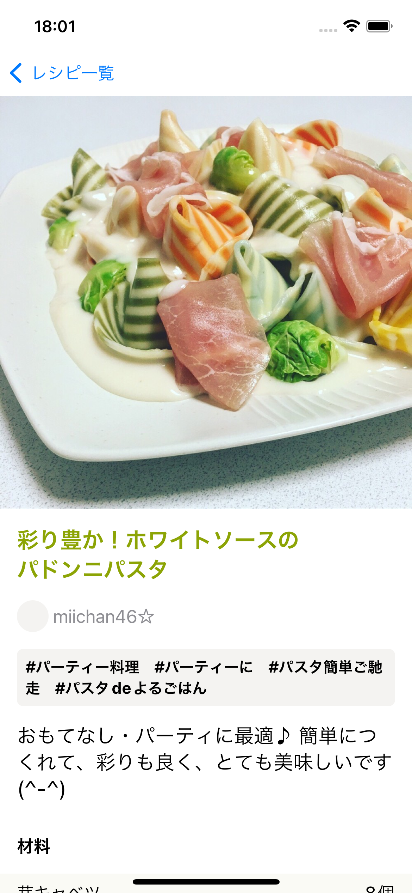 | 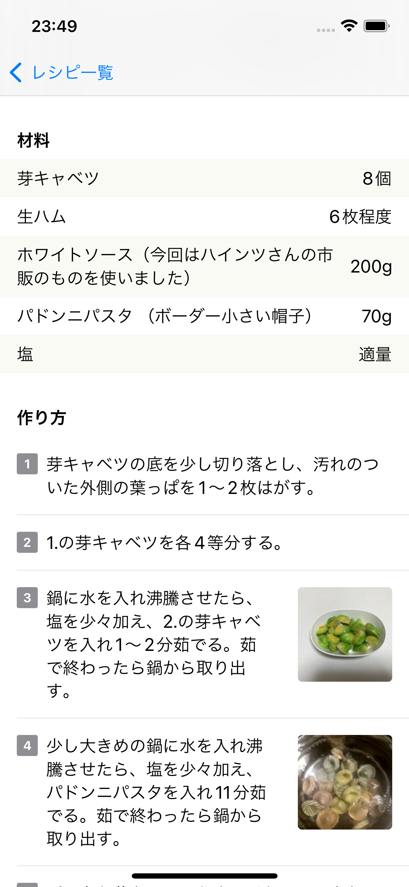 | 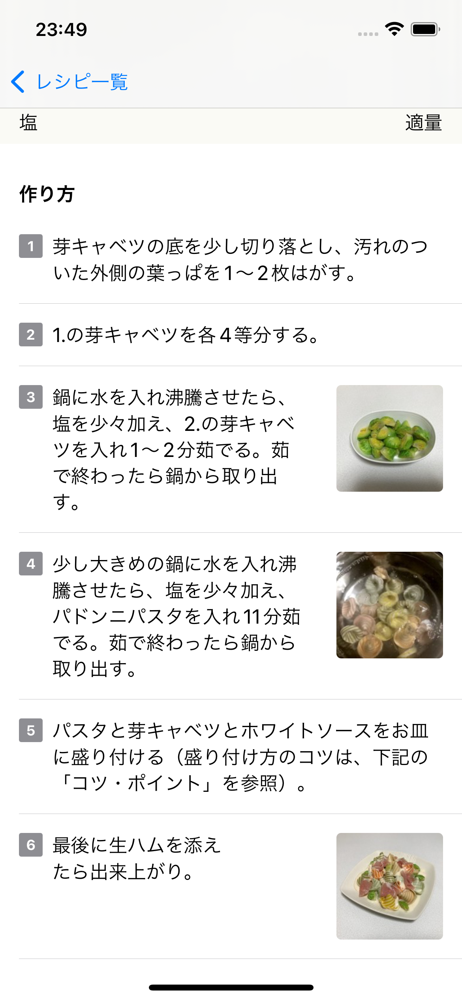 |

## 仕様
以下の仕様を満たすレシピ詳細画面を作成してください。

### 画面遷移
- レシピ一覧画面からタップされたレシピの`id`を受け取ってレシピ詳細画面に遷移する
  - レシピ詳細画面のViewは `RecipeDetailView.swift` という名前で作成すること

### API通信
- レシピ一覧画面から受け取ったレシピの`id`を使ってレシピ詳細画面表示時にAPIリクエストを送り、レシピの詳細情報を取得する
  - `RecipeDetailViewModel.swift` という名前でViewModelを作成し、APIリクエスト及び画面に表示するデータの更新はRecipeDetailViewModel内で行うこと

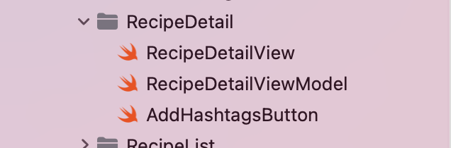

- `GetRecipeDetailRequest`と`GetRecipeHashtagsRequest`、2つのAPIリクエストは並列で行う
  - レシピ一覧は2つのAPIリクエストを直列で行なっていましたが、レシピ詳細画面のAPIリクエストで使用する`GetRecipeDetailRequest`と`GetRecipeHashtagsRequest`に必要なパラメータ（レシピの`id`）は既に持っているため、この2つのAPIリクエストは並列で実行することができます
  - APIリクエストを並列で行う方法については[SwiftのLanguage Guide](https://docs.swift.org/swift-book/LanguageGuide/Concurrency.html)などで調べてみましょう
- `GetRecipeDetailRequest`と`GetRecipeHashtagsRequest`のレスポンスは`Entity/RecipeDetailItem`にまとめる

### 画面
- レシピ画像を画面幅いっぱいに広げて見せる
  - 画像の縦横比は崩さない
  - 画像は正方形（縦横比1:1）でクロップする
  - 必要であれば「補足1」も見てください

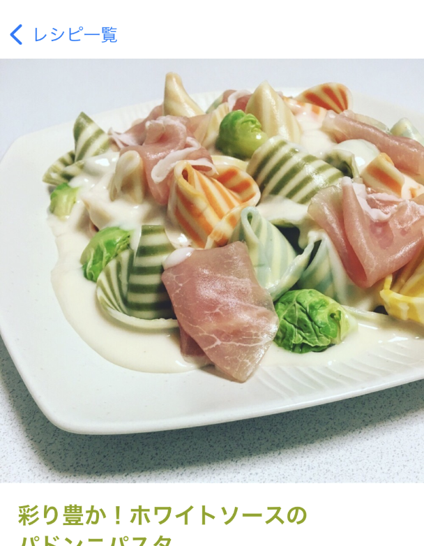

- レシピタイトルを表示する
  - 文字は太字
  - 文字色は `Color.recipeTitle`

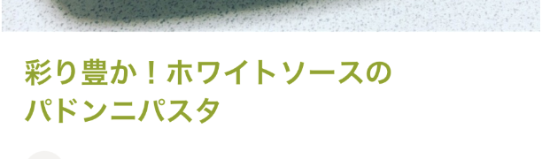

- 作者アイコンを表示する
  - `30x30`の大きさ
  - 画像は丸くして表示する
- 作者名を表示する

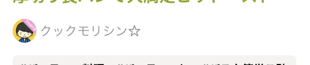

- レシピに紐づくハッシュタグを表示する
  - 文字は太字
  - 最大行数は2
  - 背景色は `Color.smoke` で画面幅いっぱいに表示する
  - `6px`の角丸を付ける

| 1行 | 2行 |
| :---: | :---: |
| 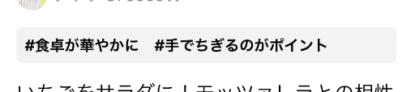 | 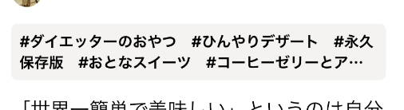 |

- レシピの説明文を表示する

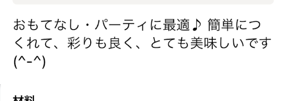

- 材料欄を表示する
  - 「`材料`」というセクションヘッダーを先頭に付ける
    - 文字は太字
  - 材料名を左揃え、分量を右揃えで表示
  - 最初の行を0行目とした時に
    - 偶数行（0行目、2行目...）の背景色は `Color.ivory`
    - 奇数行（1行目、3行目...）の背景色は `Color.white`

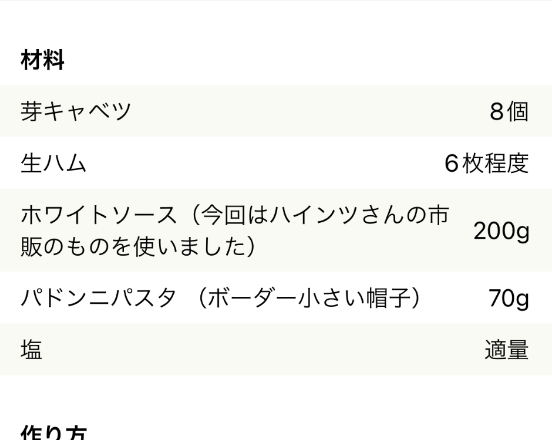

- 作り方欄を表示する
  - 「`作り方`」というセクションヘッダーを先頭に付ける
    - 文字は太字
  - 作り方の行の左側に番号を付ける
    - 最初の行を0行目とした時に、0行目には「1」という番号を付ける
  - 作り方の説明を表示する
  - 作り方の画像がある場合は、右側に表示する
    - `90x90`の大きさ
    - `4px`の角丸を付ける
  - 各行の間に区切り線を表示する
    - 左側の余白は`16px`
    - 右側の余白はなし

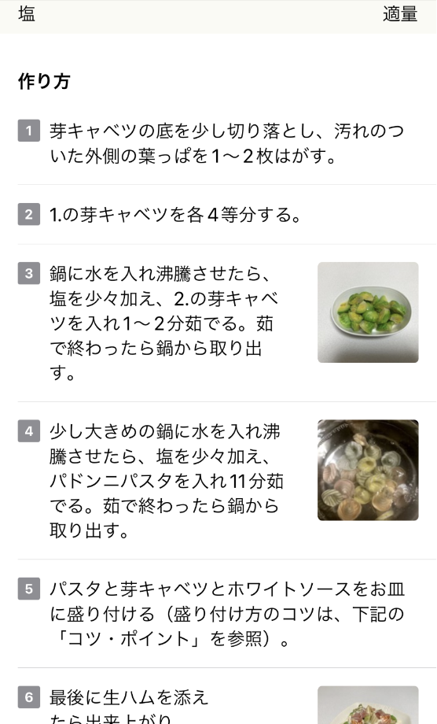

- レシピ写真以外の左右の余白は`16px`ずつ
  - ただし材料欄の背景色は画面幅いっぱいに広げる

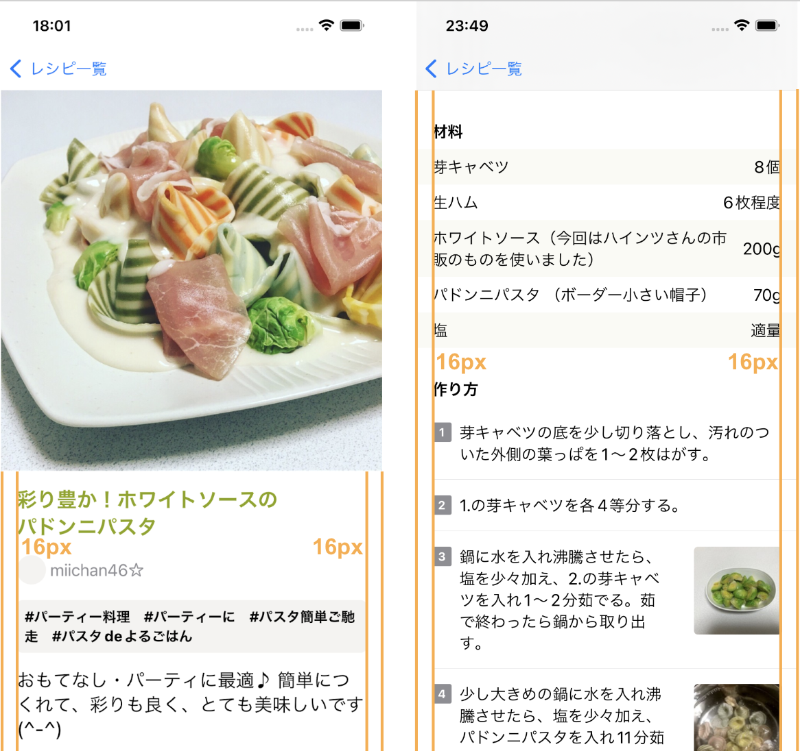

上記で指定のない部分のデザイン・レイアウトは自由です。
参考までに画面例作成時に使用したフォントサイズなどの各種値を下に書いておいたので、必要があれば画面作成時の値を決める際に役立ててください。

### 画面作成時の値（必要に応じて参照してください）
#### 上下の余白
8の倍数（8px, 16px, 24px, 32px...）

#### フォントサイズ
- レシピタイトル: `.title2`
- 作者名: `.body`
- ハッシュタグ: `.subheadline`
- レシピの説明文: `.title3`
- 「材料」「作り方」のセクションヘッダー: `.headline`
- 材料欄の各行: 指定なし
- 作り方欄の各行: 指定なし

#### 文字色
- レシピタイトル: `.recipeTitle`
- 作者名: `.gray`
- ハッシュタグ: `.black`
- レシピの説明文: `.black`
- 「材料」「作り方」のセクションヘッダー: `.black`
- 材料欄の各行: 指定なし
- 作り方欄の各行: 指定なし

## 追加課題（余力がある人はチャレンジしてみよう）
- レシピ一覧のレシピ画像の縦横比が画像の元々の縦横比と異なるため、よく見ると画像が歪んでしまっています。画像の縦横比を崩さずに正方形（縦横比1:1）でクロップしてみましょう

## 参考
- [ハンズオンで紹介しなかった知っておいてほしいこと](https://github.com/cookpad/cookpad-internship-2021-summer-ios/blob/c91896defe178d6b415f8659a3946c3c2fabadf5/Documents/chapter_06.md)
  - 2021サマーインターン資料より

- [SwiftUI | Apple Developer Documentation](https://developer.apple.com/documentation/swiftui/)
  - Appleの公式ドキュメントです
  - ViewやView Modifierの使い方などが書いてあります

## [補足1] 画像を正方形（縦横比1:1）でクロップする
画像を正方形（縦横比1:1）でクロップする、について少し補足をします。

まず、[`Image`](https://developer.apple.com/documentation/swiftui/image)をリサイズするためには[`resizable`](https://developer.apple.com/documentation/swiftui/image/resizable(capinsets:resizingmode:))というModifierを付ける必要があります。レシピ一覧画面で使った`RemoteImage`は、内部で既に`resizable`が適用されています。

```swift
Image(uiImage: image).resizable()
```

次に、[`aspectRatio(_:contentMode:)`](https://developer.apple.com/documentation/swiftui/view/aspectratio(_:contentmode:)-771ow)というModifierを使うと、Viewの縦横比（アスペクト比）を指定することができるのですが、これを`RemoteImage`に適用すると、画像自体の縦横比が変わってしまい画像が歪んでしまいます。

```swift
RemoteImage(urlString: item.recipe.imageUrl)
    .aspectRatio(1.0, contentMode: .fill) // 画像自体の縦横比が変わってしまう
```

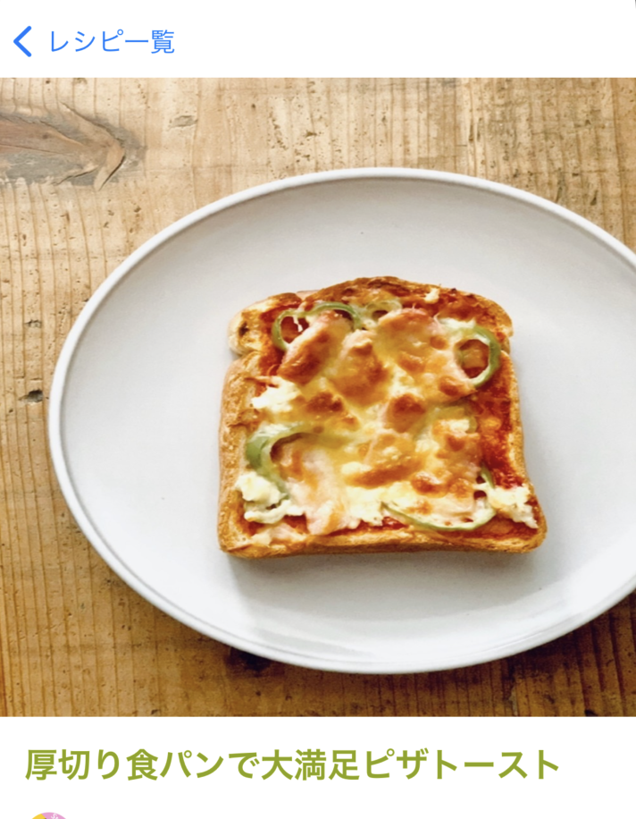

今回の要件である「画像の縦横比は崩さずに画像を正方形（縦横比1:1）でクロップする」はどのようにすれば実現できるでしょうか。各自で考えて取り組んでみましょう。

*正方形クロップ時*

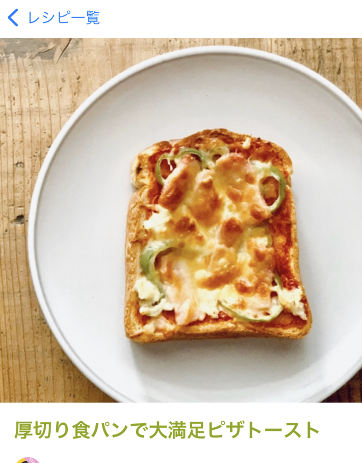

ref: [Fitting images into available space - Apple Developer](https://developer.apple.com/documentation/swiftui/fitting-images-into-available-space)

---

[Chapter6へ進む](chapter_06.md)
