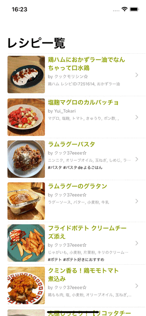

# 発展課題 レシピ一覧画面にページネーション機能を追加しよう
この発展課題では、レシピ一覧画面にページネーション機能を追加します。
完成すると、以下のgif画像のようになります。



## 仕様
### ページネーション
`http://localhost:3001/recipes`のリクエストに対して、レスポンスで以下のページネーションに関する情報が返ってきます。

```swift
  ...
  "page_info": {
    "next_page_cursor": "12345",
    "has_next_page": true
  }
```

`has_next_page`は追加で取得できるデータがあるかどうかを表すBool値です。

`has_next_page`が`false`の場合は、追加で取得できるデータがないのでこれ以上APIリクエストをしてはいけません。

`has_next_page`が`true`の場合は、`next_page_cursor`の値を次のAPIリクエストの`cursor`クエリパラメータに指定して送ることで、後続のデータを取得することができます。

次のAPIリクエスト
```
http://localhost:3001/recipes?cursor=12345&limit=10
```

`http://localhost:3001/recipes`のリクエストに対応する`Networking/Request/GetRecipeListRequest`では、`cursor`クエリパラメータの値に`pageInfo.nextPageCursor`を指定する処理が既に実装されています。

```swift
    var queryItems: [URLQueryItem] {
        var items: [URLQueryItem] = [.init(name: "limit", value: String(limit))]
        if let pageInfo = pageInfo {
            items.append(.init(name: "cursor", value: pageInfo.nextPageCursor))
        }
        return items
    }
```

よって、

* 初回ロード時はGetRecipeListRequestの`pageInfo` propertyを`nil`にする
* 追加ロード時は、GetRecipeListRequestの`pageInfo` propertyに、前回のリクエストのレスポンスで返ってきた`pageInfo`を渡す

ことで、ページネーションを実現できそうです。

## 追加課題（余力がある人はチャレンジしてみよう）
* `View/RecipeList/RecipeListView` のtask Modifierのクロージャは、レシピ詳細画面からレシピ一覧画面に戻ってきた時にも呼ばれています。そのため、現状の実装のままだとレシピ詳細画面からレシピ一覧画面に戻ってくる度に、追加ロードしたレシピが消えてしまいます。レシピ詳細画面からレシピ一覧画面に戻ってきた時にはAPIリクエストを送らないように改善してみましょう

* Pull-to-refreshで、ユーザーの任意のタイミングでデータを再ロードできるようにしてみましょう

## 参考
`View/AutoLoadingIndicator.swift`というViewがプロジェクト内に既に追加されています。必要であればページングの実装時に使ってください（`AutoLoadingIndicator`を使わなくてもページングは実現可能なので、無理して使う必要はありません）
